# PPNAM Station 1 — Scanner App Standard Operating Procedure

**Document:** PPNAM-SOP-001  
**System:** PPNAM Station 1 AA (Android Scanner App)  
**Applies to:** Chainway C72 / compatible RFID scanner running `com.sysone.scanner`

## Table of Contents

1. [Overview](#1-overview)  
2. [Prerequisites](#2-prerequisites)  
3. [App Launch & Dashboard](#3-app-launch--dashboard)  
4. [Settings Configuration](#4-settings-configuration)  
5. [Step 1 – SAP Document Lookup](#5-step-1--sap-document-lookup)  
6. [Step 2 – Product Selection](#6-step-2--product-selection)  
7. [Step 3 – RFID Tag Assignment](#7-step-3--rfid-tag-assignment)  
8. [Step 4 – Pallet Offloading](#8-step-4--pallet-offloading)  
9. [Completing a Session](#9-completing-a-session)  
10. [Error Messages & Recovery](#10-error-messages--recovery)  
11. [Unassign Mode](#11-unassign-mode)  
12. [Reassign Mode](#12-reassign-mode)  

## 1. Overview

The PPNAM Station 1 Scanner App is used by goods-receiving operators to register incoming pallets against SAP Purchase Orders or Stock Transfer Requests. The workflow is: **SAP Lookup → Product Selection → RFID Tag Assignment → Offloading**.

## 2. Prerequisites

- Scanner device is charged and powered on.
- Wi-Fi is connected to the site network.
- Station 1 PC is running with MQTT broker online.
- App is installed: `com.sysone.scanner`.
- Settings are configured (MQTT host, scanner ID, station ID — see Section 4).

## 3. App Launch & Dashboard

Tap the **PPNAM Scanner** icon on the home screen to launch the app.

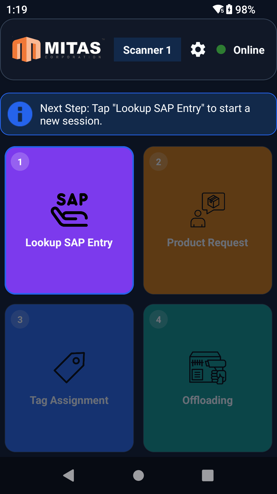

<em>Main dashboard — no active session</em>

The dashboard shows four workflow tiles. When no session is active the tag assignment and offload tiles are greyed out. The tiles become enabled as you progress through the workflow.

- **Lookup SAP Entry** — start a new receiving session (Step 1).
- **Tag Assignment** — assign RFID tags to pallets (Step 3, enabled after product selection).
- **Offload** — scan pallets off the truck (Step 4, enabled after tag assignment).
- **Settings (⚙)** — configure MQTT, scanner, and station settings.

### 3.1 Station Offline State

If Station 1 is not running or the network is unavailable, the dashboard shows a full-screen offline overlay blocking all workflow tiles:

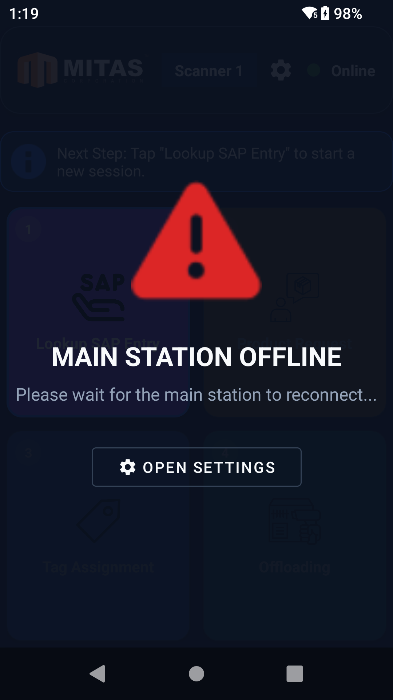

<em>Dashboard — station offline overlay</em>

The overlay clears automatically once Station 1 comes back online and the MQTT connection is restored. Check that the Station 1 PC is running and connected, or verify MQTT/Wi-Fi settings (Section 4).

## 4. Settings Configuration

Tap the **⚙ gear icon** (top-right of the dashboard). Enter the supervisor password when prompted.

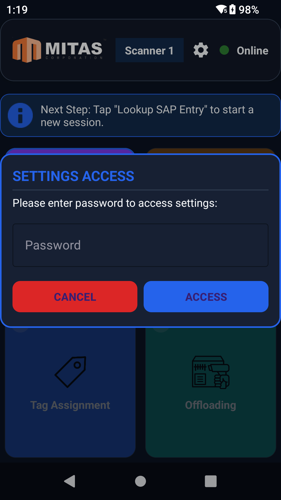

<em>Settings — password prompt</em>

Type the supervisor password and tap **ACCESS**.

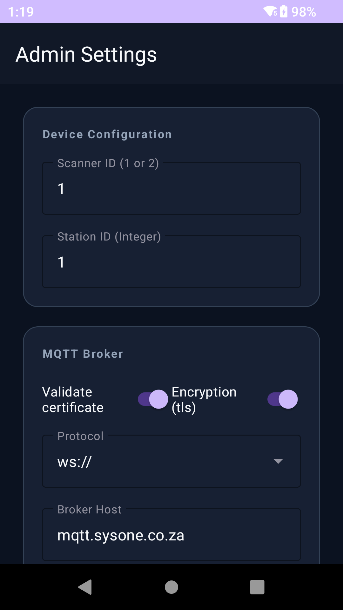

<em>Settings — top section (MQTT and scanner IDs)</em>

**MQTT Settings:** Enter the broker host, port, and credentials provided by your IT team. **Scanner ID** and **Station ID** identify this device on the network.

<em>Settings — middle section</em>

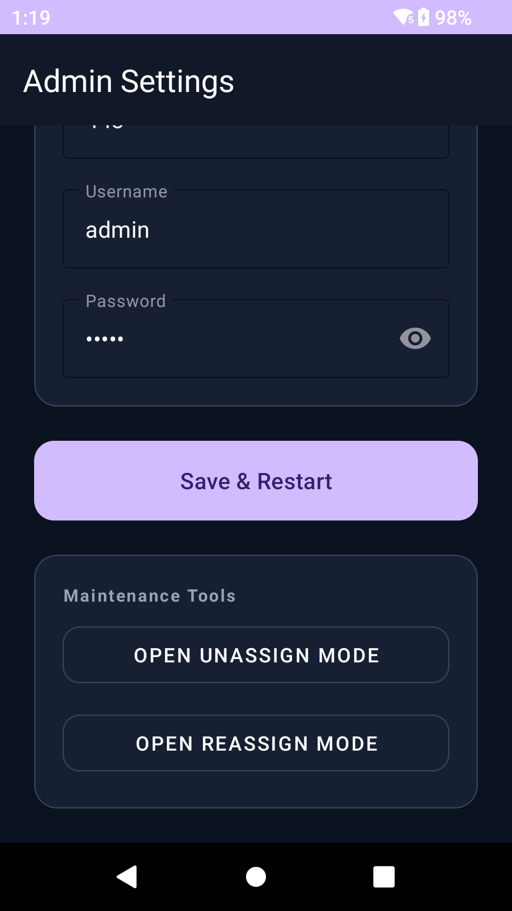

<em>Settings — bottom section (Unassign / Reassign buttons)</em>

Scroll to the bottom to access **Unassign Mode** and **Reassign Mode** (see Sections 11 and 12).

> **Note:** Changes are saved automatically. Tap the **back arrow** to return to the dashboard.

## 5. Step 1 – SAP Document Lookup

Tap **Lookup SAP Entry** on the dashboard. Enter the SAP document number and select the document type, then tap **LOOKUP**.

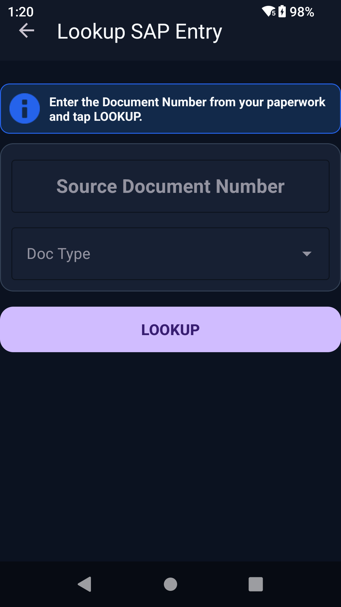

<em>SAP Lookup screen — empty</em>

- **Document Number** — enter the SAP PO number or Transfer Request number.
- **Document Type** — select *Purchase Order* or *Stock Transfer* from the dropdown.

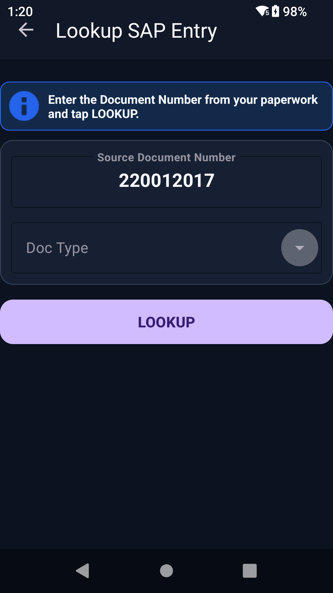

<em>SAP Lookup screen — PO number entered and type selected</em>

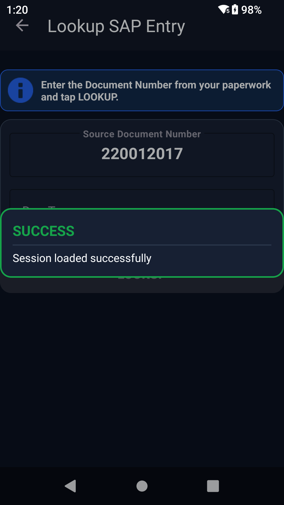

<em>SAP Lookup — waiting for station response</em>

The app contacts the Station 1 PC. A progress indicator is displayed while waiting.

<em>SAP Lookup — success confirmation (auto-dismisses after 2 s)</em>

On success, the app shows a brief confirmation and automatically navigates to the **Product Selection** screen.

## 6. Step 2 – Product Selection

The product list shows all open lines from the SAP document. Tick the checkbox next to each product that is being received in this delivery, then tap **REQUEST**.

<em>Product Selection — product list loaded</em>

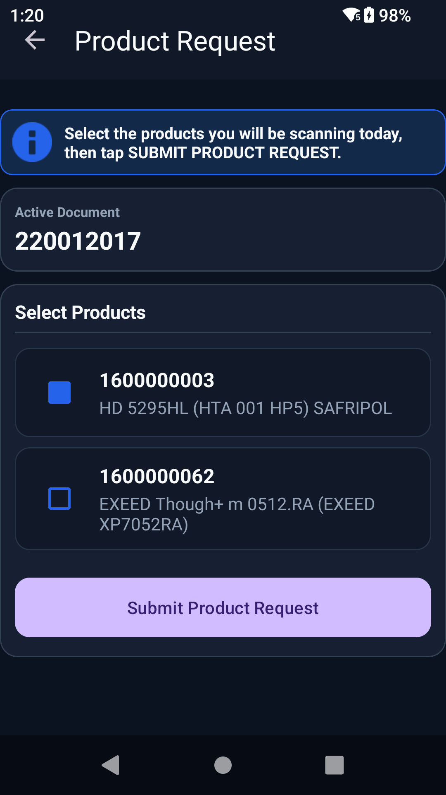

<em>Product Selection — product ticked</em>

Tick each product line being received. If multiple products are on the document tick all that apply. Tap **REQUEST** when done.

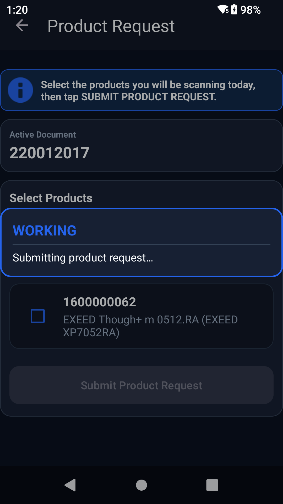

<em>Product Request — Working popup while Station 1 processes the selection</em>

A **Working** popup appears while the app waits for Station 1 to acknowledge the selection.

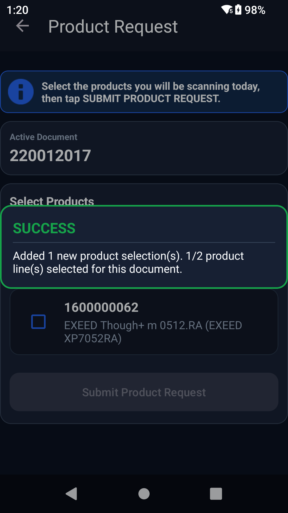

<em>Product Request — success confirmation (auto-dismisses after 2 s)</em>

On success, a brief confirmation appears and the app navigates to Tag Assignment.

## 7. Step 3 – RFID Tag Assignment

The Tag Assignment screen is where RFID tags are paired with pallets. For each pallet on the truck, scan its RFID tag and tap **SUBMIT**.

<em>Tag Assignment — ready to scan first tag</em>

- **Product spinner** — select the product for this pallet if multiple products are active.
- **Pallet sequence** — enter the pallet number (auto-increments by default).
- **Scan RFID Tag** — place the RFID tag in range of the scanner, or type the tag ID.
- **SUBMIT** — confirms the tag and creates the pallet record in Station 1.

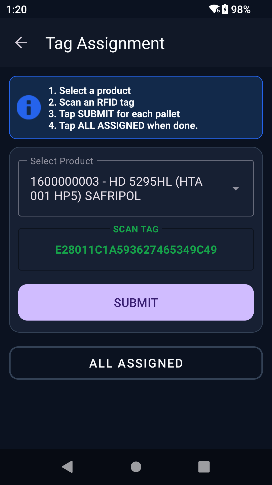

<em>Tag Assignment — RFID tag detected, ready to submit</em>

The scanned tag ID appears in the RFID field. Review it, then tap **SUBMIT**.

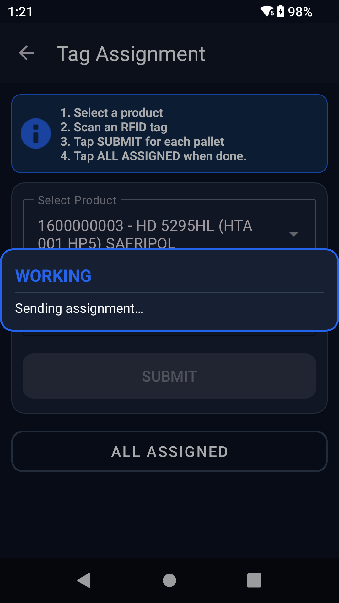

<em>Tag Assignment — Working popup while Station 1 creates the pallet record</em>

A **Working** popup appears while Station 1 creates the pallet record and generates a barcode.

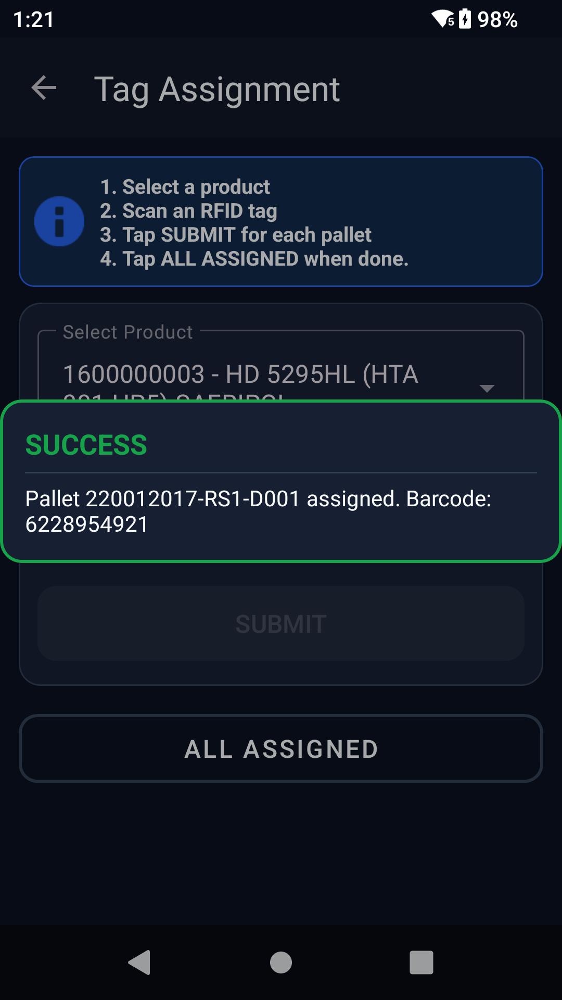

<em>Tag Assignment — success popup showing pallet barcode (auto-dismisses after 2 s)</em>

On success, the station returns a barcode for the pallet. The popup auto-dismisses after 2 s and the pallet is added to the assignment list.

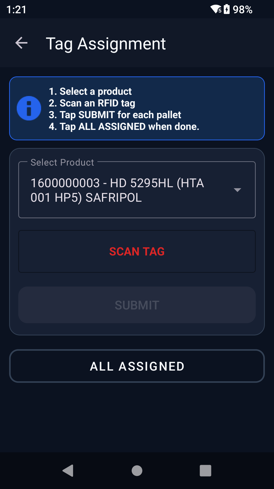

<em>Tag Assignment — pallet 1 in the list, ready for next scan</em>

The pallet is added to the assignment list below. Repeat for each pallet on the truck.

<em>Tag Assignment — all pallets assigned</em>

When all RFID tags have been scanned, tap **ALL ASSIGNED** to confirm that all pallets for this delivery have been registered.

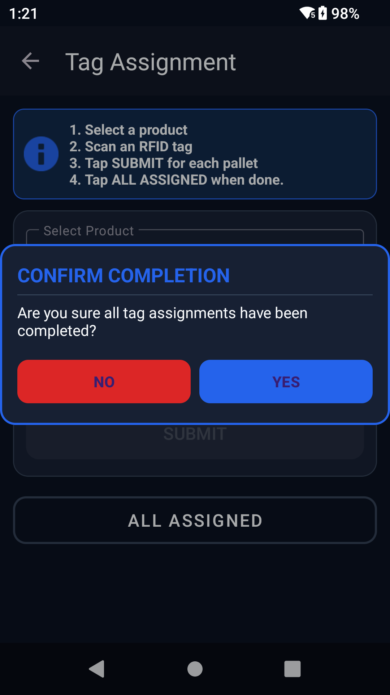

<em>All Assigned — confirmation dialog</em>

Tap **YES** to confirm all pallets are assigned and proceed to printing.

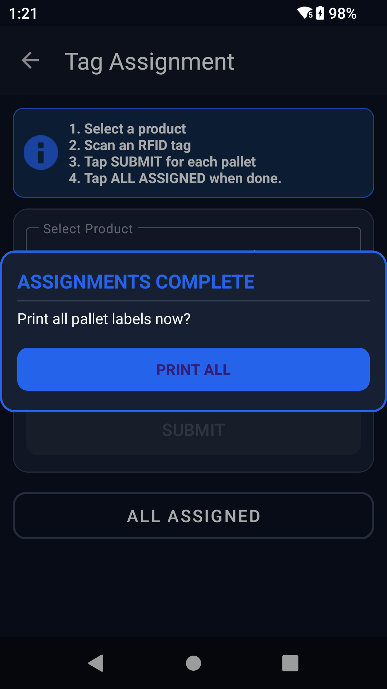

<em>Print All — popup after All Assigned</em>

A popup confirms assignments are complete and prompts to print all labels. Tap **PRINT ALL** to send all pallet labels to the label printer.

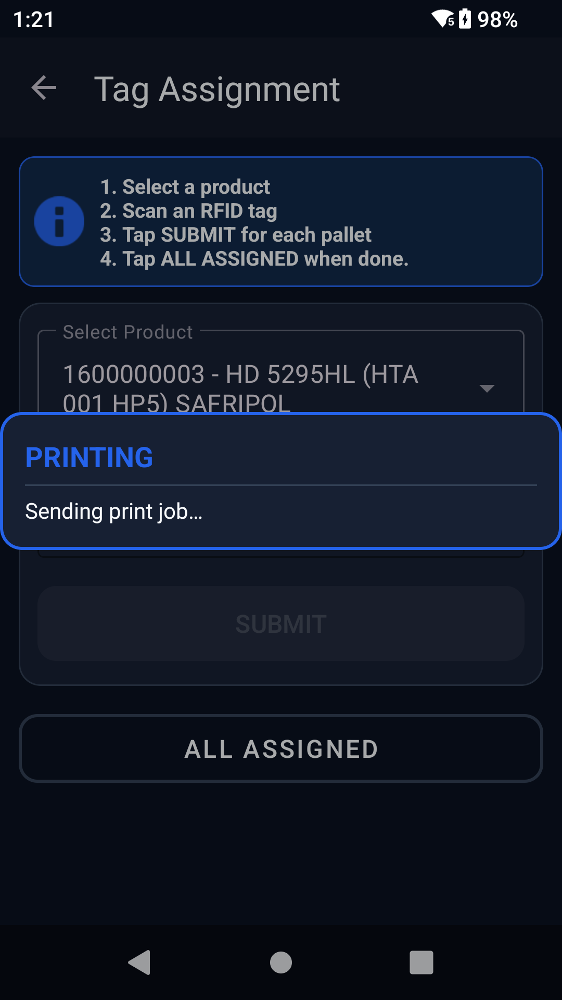

<em>Label Printing — Printing popup while labels are sent to the printer</em>

A **Printing** popup appears while labels are being sent to the printer.

<em>Label Printing — success confirmation (auto-dismisses after 2 s)</em>

On success, all labels are printed and the app navigates to the **Offload** screen.

## 8. Step 4 – Pallet Offloading

After printing, the app navigates to the **Offload** screen. As each pallet is removed from the truck, scan its **barcode** first, then scan its **RFID tag**, and tap **SUBMIT**.

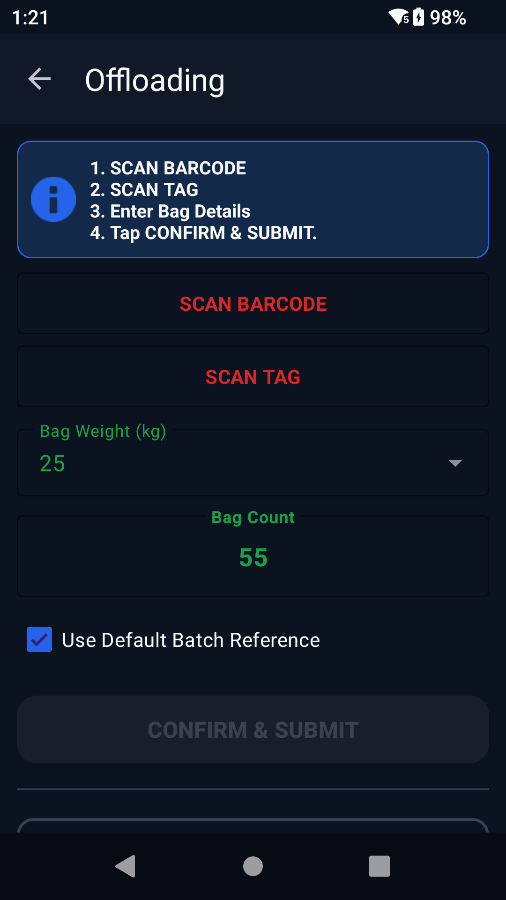

<em>Offload screen — ready to scan first pallet</em>

- **Barcode** — scan the printed label barcode or type it manually.
- **RFID Tag** — scan the pallet's RFID tag.
- **Bag Count** — enter the actual number of bags on this pallet.
- **SUBMIT** — records the offload and validates the barcode/RFID pair.

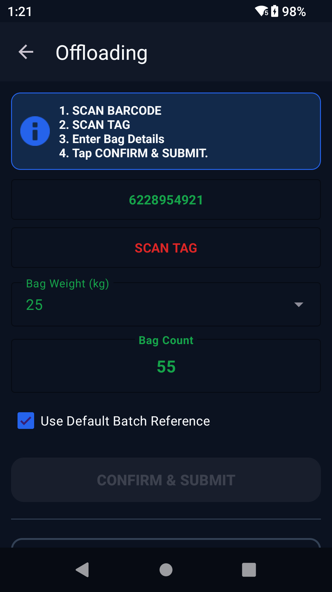

<em>Offload — barcode scanned for pallet 1</em>

Pallet 1: scan the barcode. The barcode field populates automatically.

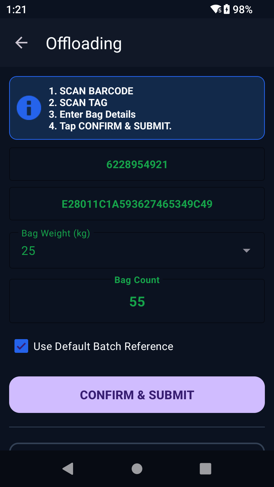

<em>Offload — RFID scanned for pallet 1</em>

Then scan the RFID tag. Both fields are now populated.

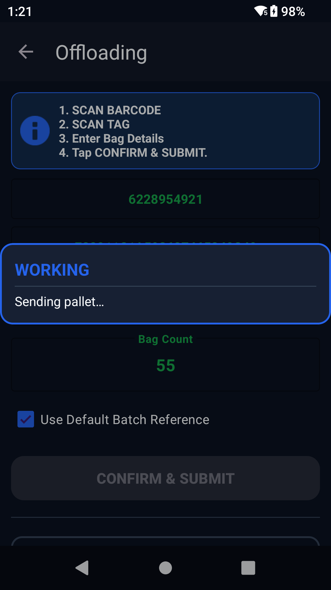

<em>Offload — Working popup while Station 1 validates and records the pallet</em>

A **Working** popup appears while Station 1 validates the barcode/RFID pair.

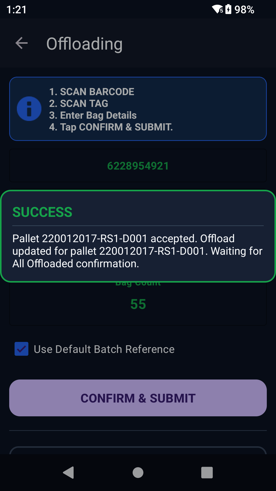

<em>Offload — success confirmation (auto-dismisses after 2 s)</em>

On success, the fields clear ready for the next pallet. Repeat for every pallet.

<em>Offload — pallet 1 recorded, fields cleared for next scan</em>

<em>Offload — barcode scanned for pallet 2</em>

Pallet 2: scan the barcode. The barcode field populates automatically.

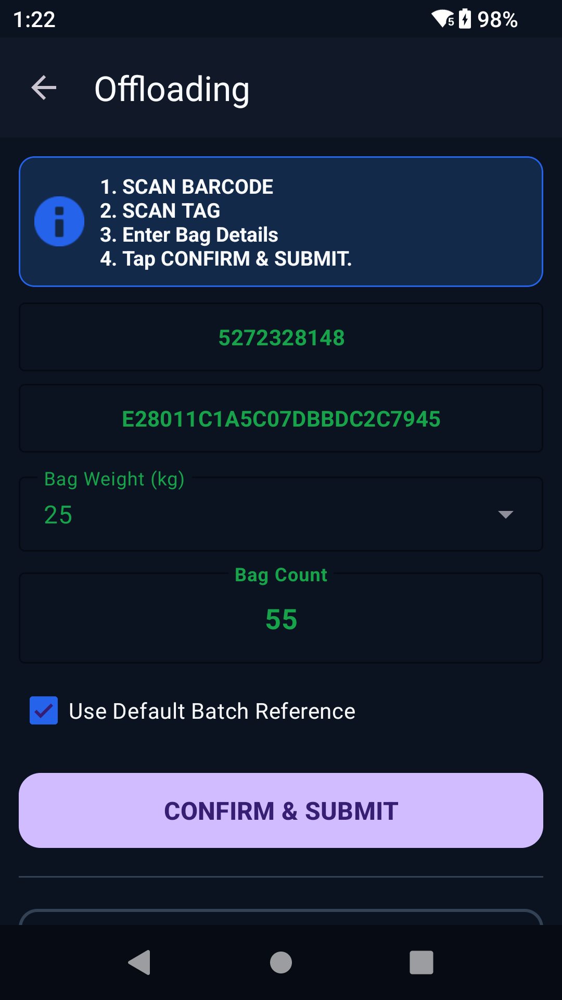

<em>Offload — RFID scanned for pallet 2</em>

Then scan the RFID tag. Both fields are now populated.

<em>Offload — pallet 2 successfully recorded</em>

A success message confirms the offload. The fields clear ready for the next pallet. Repeat for every pallet.

## 9. Completing a Session

When all pallets are offloaded, tap **FINISH SESSION**. Confirm when prompted. The station will post the pallets to SAP.

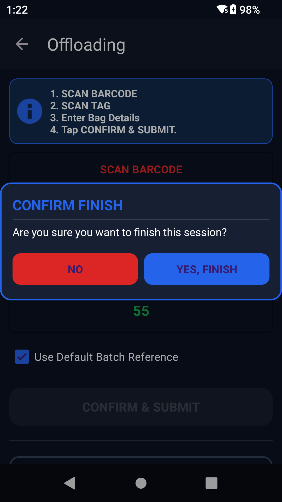

<em>Finish Session — confirmation dialog</em>

Tap **YES** to confirm. The station will post the receiving data to SAP.

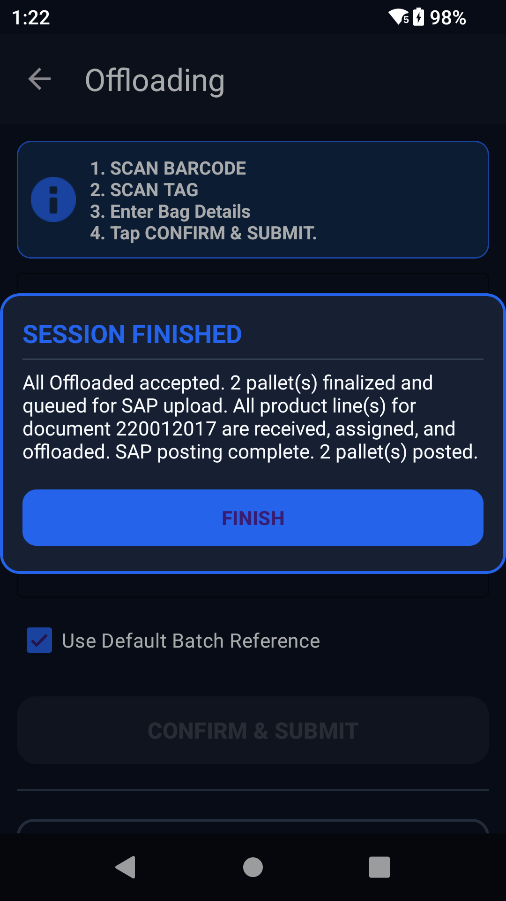

<em>Session Finished — SAP posting complete</em>

The Session Finished popup summarises the SAP posting result. Tap **FINISH** (or **DISMISS**) to return to the dashboard.

<em>Dashboard — returned to idle after session</em>

> **Note:** The dashboard resets to the idle state. The operator can start a new session immediately by tapping **Lookup SAP Entry** again.

## 10. Error Messages & Recovery

The app displays a dismissible popup with an error title and recovery instructions whenever a step fails. Each error type and its resolution is described below.

### 10.1 SAP Lookup Failed

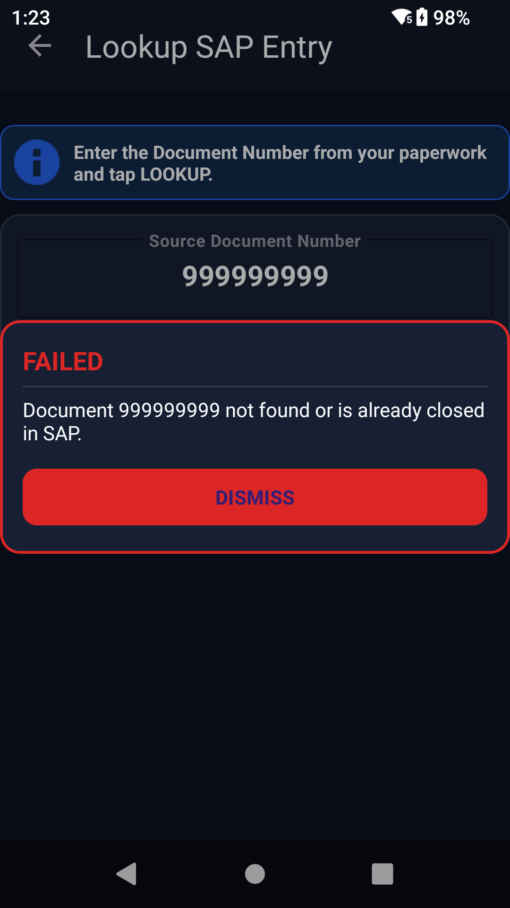

<em>Error — SAP lookup failed popup</em>

**Cause:** The document number is not found in SAP, or the document is already closed.

- Verify the document number on the delivery note.
- Confirm the correct document type (Purchase Order vs Stock Transfer) is selected.
- Contact your supervisor if the document should be open.

### 10.2 RFID Tag Assignment Failed

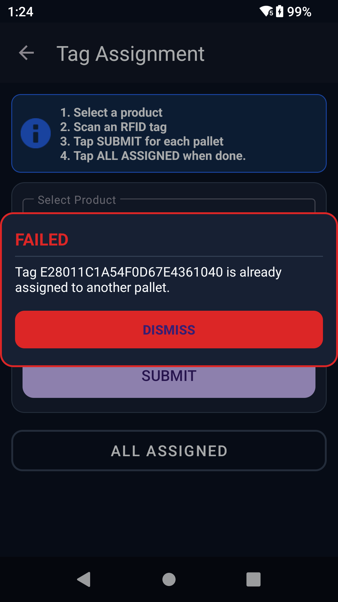

<em>Error — RFID tag assignment failed popup</em>

**Cause:** The RFID tag is already assigned to another pallet or is not readable.

- Try scanning the RFID tag again — the tag may have been misread.
- If the tag is already assigned: go to **Settings → Unassign Mode**, scan the tag to free it, then return to Tag Assignment.
- Replace a physically damaged tag and re-scan.

### 10.3 Print All Failed

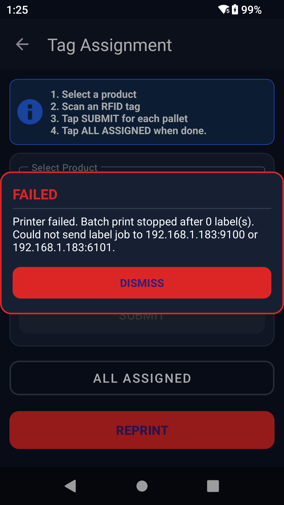

<em>Error — Print All failed popup</em>

**Cause:** The label printer is offline, out of labels, or unreachable on the network.

- Check that the TSC label printer is powered on and the green light is steady.
- Verify the printer's network cable or Wi-Fi connection.
- Tap **REPRINT** (if shown) to retry once the printer is ready.
- Contact your supervisor if the printer cannot be reached.

### 10.4 Offload Failed

If an offload scan fails (e.g., mismatched barcode/RFID pair) a popup is shown:

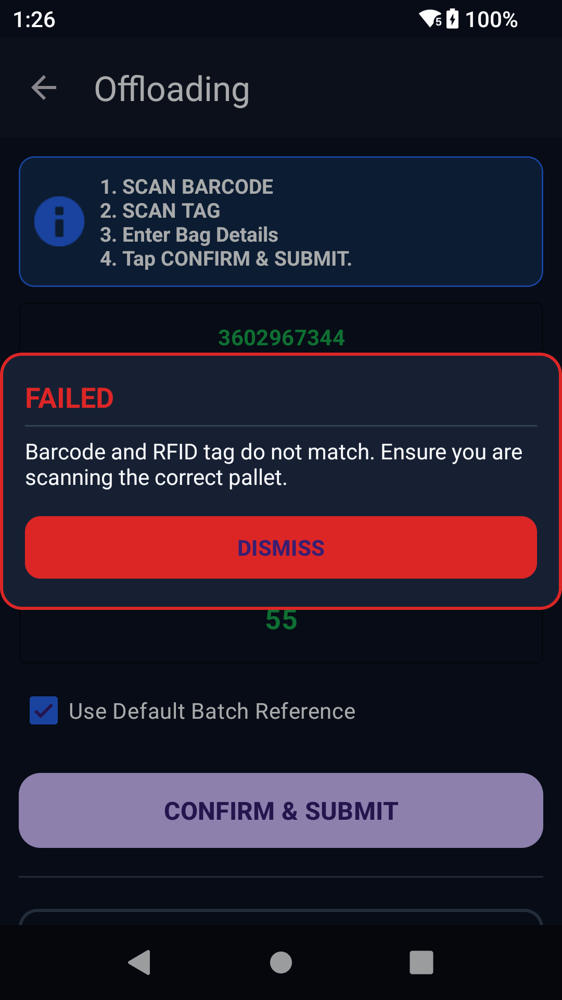

<em>Error — offload barcode/RFID mismatch popup</em>

**Cause:** The barcode and RFID tag scanned do not belong to the same pallet.

- Re-scan the barcode on the label of the pallet.
- Then re-scan the RFID tag attached to the same pallet.
- Ensure you are scanning the label and tag on the **same** pallet.
- Use **Reassign Mode** (Settings → Reassign) if a tag has been moved to a different pallet.

## 11. Unassign Mode

Use **Unassign Mode** to remove an RFID tag from its pallet assignment. This is needed when a tag has been assigned in error or needs to be reused.

Access: **Dashboard → ⚙ Settings → (scroll to bottom) → UNASSIGN MODE**

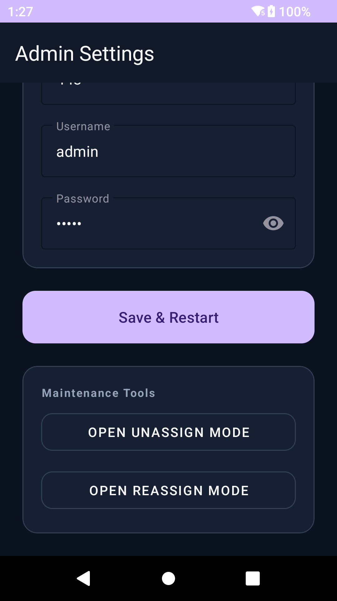

<em>Settings — scroll to bottom to find Unassign Mode button</em>

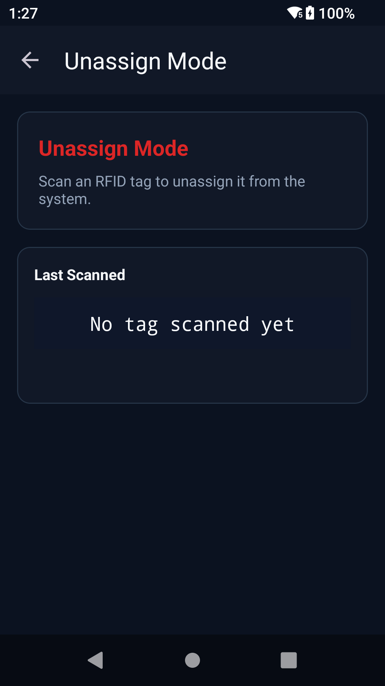

<em>Unassign Mode — waiting for RFID scan</em>

Scan the RFID tag you want to unassign. The app automatically sends the unassign request.

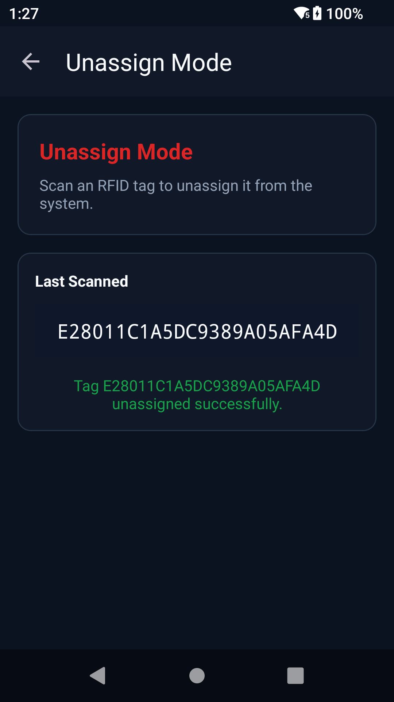

<em>Unassign Mode — success confirmation</em>

A green status message confirms the tag has been unassigned.

### 11.1 Unassign Failed

If the RFID tag is not found in the system, an error popup is displayed:

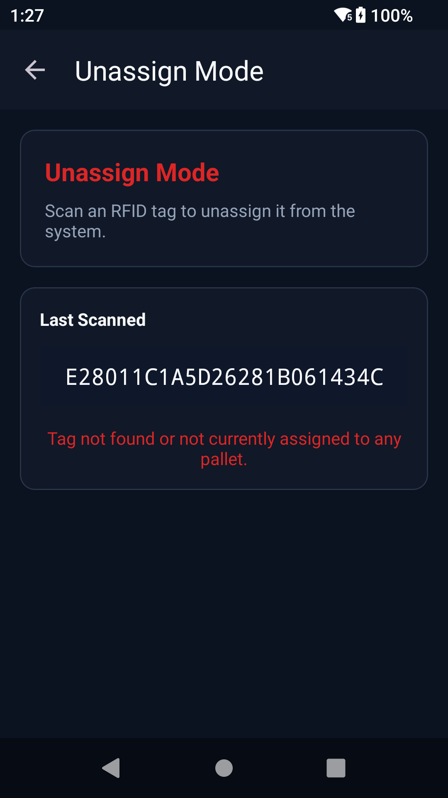

<em>Unassign Mode — tag not found error popup</em>

- Verify the correct RFID tag was scanned.
- Confirm the tag was previously assigned in an active session.
- Contact your supervisor if the tag cannot be found.

## 12. Reassign Mode

Use **Reassign Mode** to move an RFID tag from one pallet barcode to another. This is needed when a tag was accidentally placed on the wrong pallet.

Access: **Dashboard → ⚙ Settings → (scroll to bottom) → REASSIGN MODE**

<em>Settings — Reassign Mode button at bottom of settings</em>

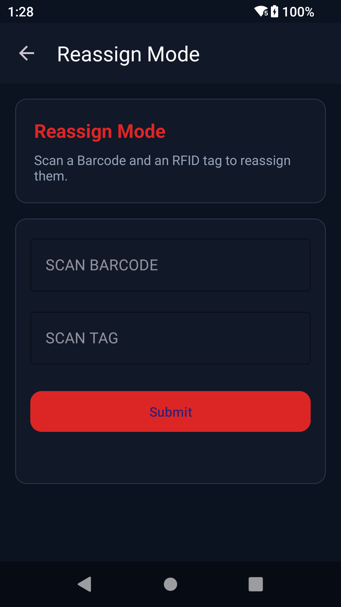

<em>Reassign Mode — ready to scan</em>

1. Scan the **barcode** on the target pallet label (destination barcode).  
2. Scan the **RFID tag** to be moved.  
3. Tap **SUBMIT**.

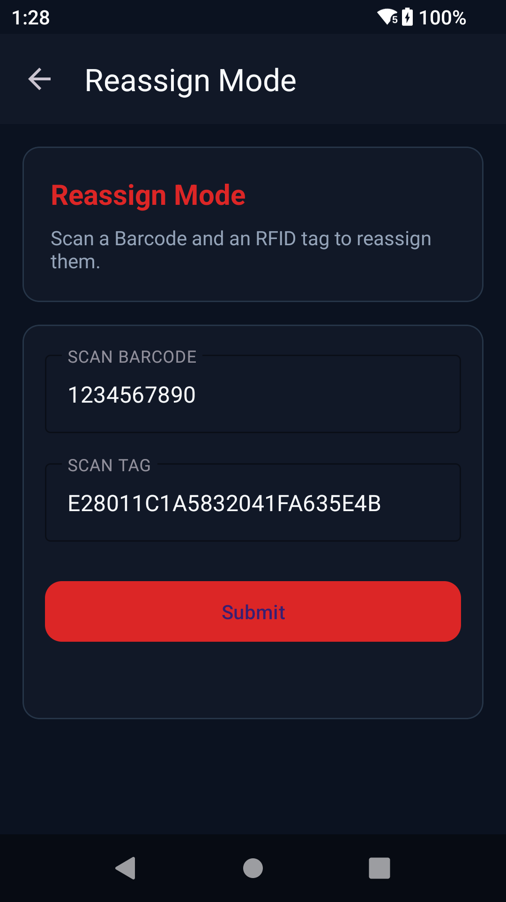

<em>Reassign Mode — barcode and RFID filled in, ready to submit</em>

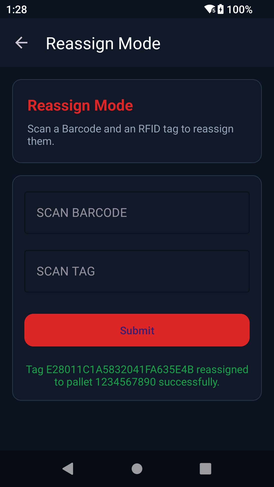

<em>Reassign Mode — success confirmation</em>

A green status message confirms the tag has been reassigned.

### 12.1 Reassign Failed

If the barcode is not found in any active session, an error popup is displayed:

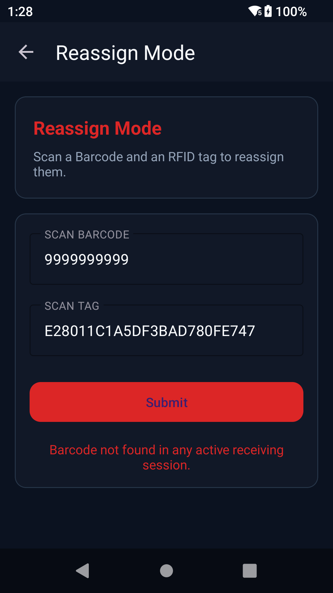

<em>Reassign Mode — barcode not found error popup</em>

- Verify the barcode was scanned correctly.
- Ensure the barcode belongs to a pallet in an active receiving session.
- Contact your supervisor if the pallet cannot be found.

## 13. Troubleshooting Summary

Quick reference for common issues:

| Error | Likely Cause | Action |
|---|---|---|
| SAP lookup failed | Wrong doc number / doc closed | Check doc number and type |
| Tag already assigned | Tag used twice | Use Unassign Mode first |
| Print failed | Printer offline | Power cycle printer, check network |
| Offload mismatch | Wrong barcode/RFID combo | Re-scan the correct pallet |
| MQTT connect failed | Wi-Fi or broker issue | Check Wi-Fi; update Settings |
| Unassign failed | Tag not assigned | Verify tag ID with supervisor |
